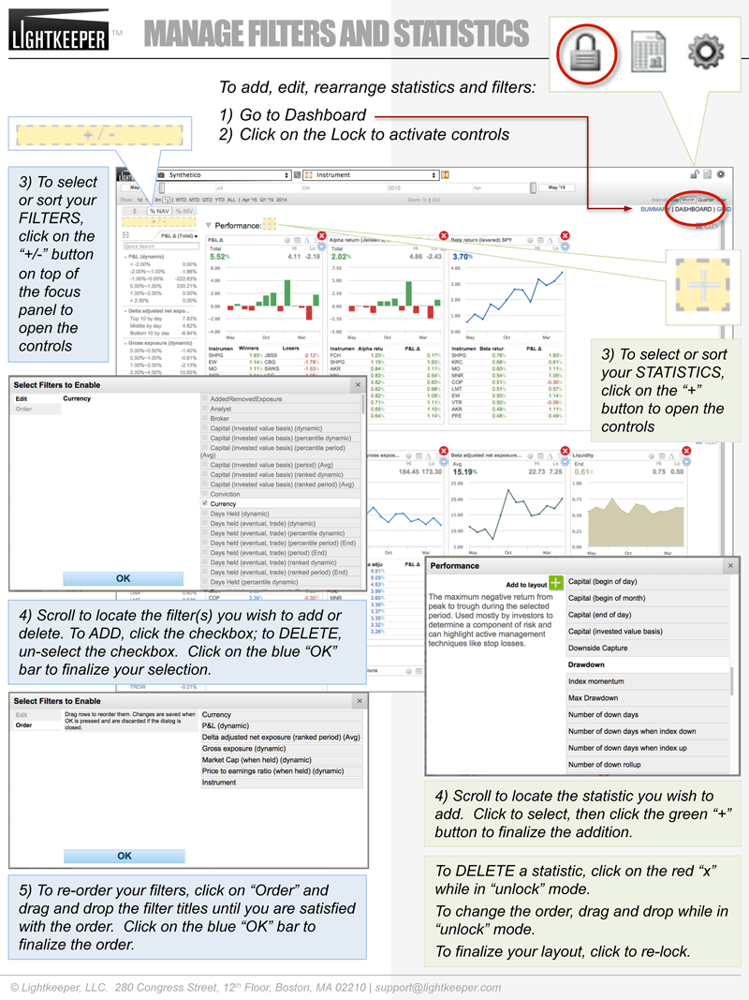

# First Chapter

# BASIC TRAINING

## Manage Filters and Statistics in Your Layout

### To add, edit, arrange statistics (data lenses) and filter:

### 1) Click to "DASHBOARD" view

### 2) Open controls by clicking on "LOCK" icon in system icon area

### 3) To revise and order FILTERS

    a) Navigate to the  "+/-" button above the focus column to open controls.  Select the "Edit" option.
    
    b) Scroll to select the filters you with to add or delete.  Filter names are sorted alphabetically.
    
    c) To add filters, click the check-box; to delete, un-check the box.  You can add or delete multiple filters. Click on the blue "OK" button bar to finalize your selections.
    
    d) To re-order filters in your layout, select the "Order" option, and drag-and-drop the filter titles to move them.  Click on the blue "OK" button bar to finalize your selections.

