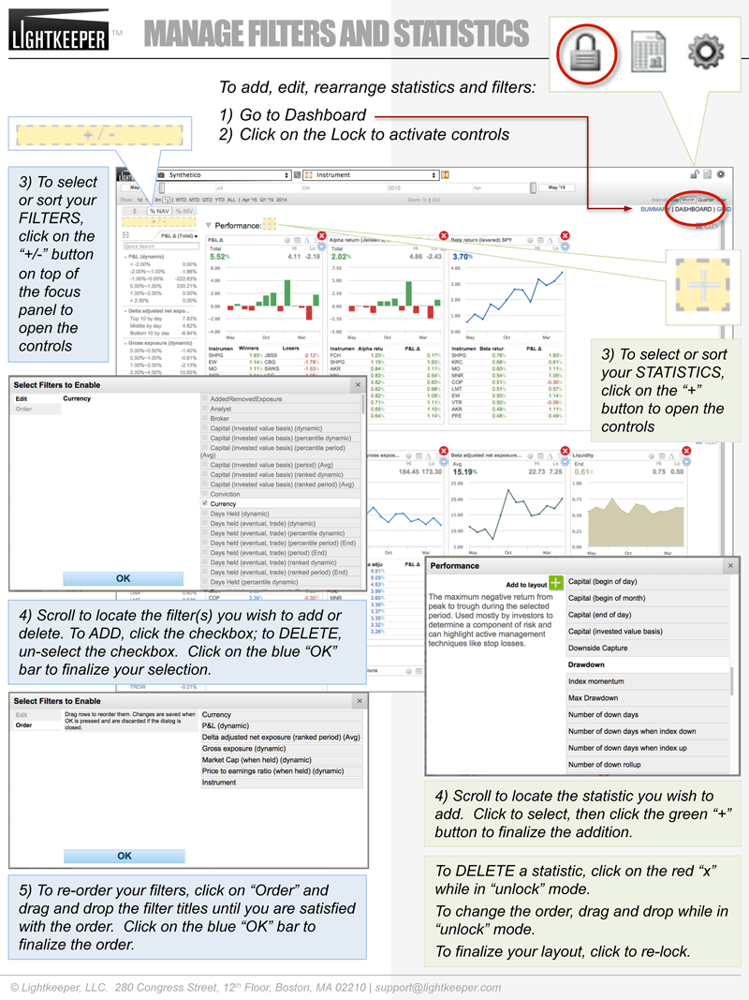

# FAQ: Bloomberg Data

## _How do I configure Bloomberg data for Lightkeeper?_

### Bloomberg Data License **FTP** Set-up

##### 1) Contact Bloomberg to obtain your **Bloomberg Data License FTP decryption key and password** credentials.

| |Things to keep in mind when speaking to your Bloomberg account representative: |
|----:|----|
|a) |Emphasize that the data will be used on **your server** and not on a third-party's server to avoid additional ongoing fees and addendums to your Bloomberg contract.|
|b) |Though Lightkeeper sets up a cloud-based server on your behalf, **you own the server.**|
|c) |Bloomberg data does not leave your server.|
|d) |You will receve two emails: (1) your **username and decryption key** and (2) your **password.**|

##### 2) Log into your Bloomberg account at https://service.bloomberg.com and request to **add the IP address of the Lightkeeper server to the FTP whitelist.**  Lightkeeper will provide you with these IP addresses.

##### 3) Enter the **Bloomberg terminal information** into Lightkeeper:
| |Click on the **Settings** icon  on the upper right of the Lightkeeper screen and navigate to "Bloomberg"  |
|----:|----|
|a) |Log into Bloomberg, then go to "**DPDF &lt;GO&gt;**" and ensure all items are **checked.**|
|b) |Go to "**IAM &lt;GO&gt;**" and get the following numbers and input into the appropriate fields in Lightkeeper:|
| | &nbsp; &nbsp;  **USERNUMBER** is found nest to the **User** field.|
| | &nbsp; &nbsp;  **SN** is the **S/N** number BEFORE the hyphen.|
| | &nbsp; &nbsp;  **WS** is the **S/N** number AFTER the hyphen.|

##### 4) When done, click on "Submit" to finish.

##### **CAVEATS**
##### _+ Bloomberg charges a monthly fee PER SECURITY with varied pricing across different asset classes.  Lightkeeper will request data in ways to help minimize those fees._
##### _+ A user must be selected whose pricing preferences should be set to adjust historical prices and volume.  Any subsequent changes to these preferences will adversely impact the data being requested from Bloomberg._
---

### Statistics (Data Lenses): Add, Edit, Arrange

##### 1) Navigate to "DASHBOARD" view
##### 2) Open controls by clicking on "LOCK" icon in system icon area
##### 3) Click on the "+" button in the section you wish to edit: Performance, Exposure, Trading, Risk, Marketplate.  Scroll down to see all sections.  

| |To **Edit** and **Order** data lenses: |
|----:|----|
|a) |Scroll to select the statistic you with to add or delete.  Filter names are sorted alphabetically.|
|b) |To add statistics, click the name of the filter, then click on the green "+" sign.|
|b) |To delete statistics, while in "unlock" mode, click the red "x" on the right-hand corner of each data lens.|
|d) |To re-order data lenses / statistics in your layout, drag and drop within the section.|

##### 4) When done, re-click the "LOCK" icon to save your filters layout.
---

###Illustrated Help-sheet: Manage Filters and Stats / Data Lenses in your Layout

!