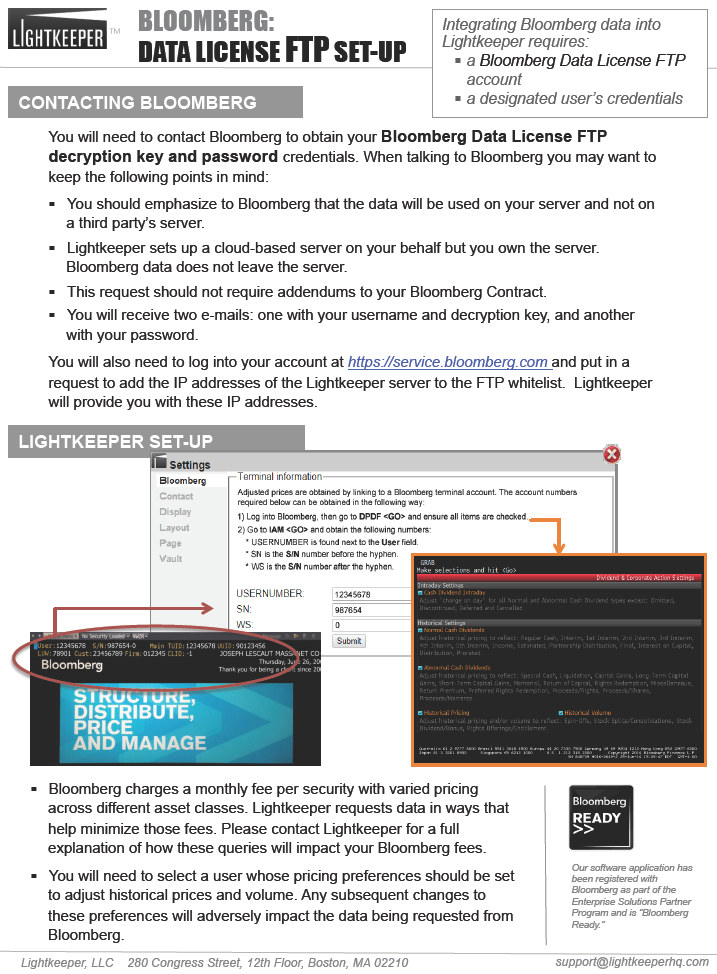

# Display Data

## _How do I adjust how my data is shown in Lightkeeper?_

### Numbers

##### "Show full number in grid" will include X decimal places. Note, this is not always a useful option, in that most decimal places past two are not significant. You can opt for how many decimal places will show for non-currency numbers in the options below this one.
"Use parentheses to indicate negative numbers" — unchecking this box will put a negative sign in front of negative numbers instead.

| |Things to keep in mind when speaking to your Bloomberg account representative: |
|----:|----|
|a) |Emphasize that the data will be used on **your server** and not on a third-party's server to avoid additional ongoing fees and addendums to your Bloomberg contract.|
|b) |Though Lightkeeper sets up a cloud-based server on your behalf, **your own the server.**|
|c) |Bloomberg data does not leave your server.|
|d) |You will receve two emails: (1) your **username and decryption key** and (2) your **password.**|

##### 2) Log into your Bloomberg account at https://service.bloomberg.com and request to **add the IP address of the Lightkeeper server to the FTP whitelist.**  Lightkeeper will provide you with these IP addresses.

##### 3) Enter the **Bloomberg terminal information** into Lightkeeper:
| |Click on the **Settings** icon  on the upper right of the Lightkeeper screen and navigate to "Bloomberg"  |
|----:|----|
|a) |Log into Bloomberg, then go to "**DPDF &lt;GO&gt;**" and ensure all items are **checked.**|
|b) |Go to "**IAM &lt;GO&gt;**" and get the following numbers and input into the appropriate fields in Lightkeeper:|
| | &nbsp; &nbsp;  **USERNUMBER** is found next to the **User** field.|
| | &nbsp; &nbsp;  **SN** is the **S/N** number BEFORE the hyphen.|
| | &nbsp; &nbsp;  **WS** is the **S/N** number AFTER the hyphen.|

##### 4) When done, click on "Submit" to finish.

##### **CAVEATS**
##### _+ Bloomberg charges a monthly fee PER SECURITY with varied pricing across different asset classes.  Lightkeeper will request data in ways to help minimize those fees._
##### _+ A user must be selected whose pricing preferences should be set to adjust historical prices and volume.  Any subsequent changes to these preferences will adversely impact the data being requested from Bloomberg._

#### [Illustrated: Download PDF &#151; Guide to Bloomberg FTP Setup](www.lightkeeper.com/gitbook/Lightkeeper_BloombergFTPsetup.pdf)

"NUMBERS"

"FILTERING" — The default is to not show cash or expenses buckets in the filter. Check the appropriate boxes to customize your view of the filtering buckets.
