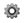
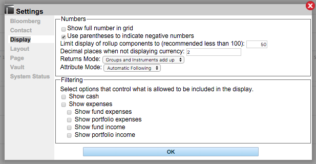

# Display Data: Settings

## _How do I adjust how my data is displayed in Lightkeeper?_

| |Click on the **Settings** icon on the upper right of the Lightkeeper screen and navigate to "Display"  |
|:----|----|
|"Show full number in grid"|Checking this box will include all available decimal places. Note, this is not always a useful option, in that most decimal places past two are not significant. You can opt for how many decimal places will show for non-currency numbers in the options below this one.|
|"Use parentheses to indicate negative numbers"|Unchecking this box will put a negative sign in front of negative numbers instead.|
|"Decimal places when not displaying currency:" |This value is usually 2.|
|"Returns Mode"|Choose between actual returns, or have groups and instruments add up.|
|"Attribute Mode"|Choose between automatic following, or manual selection.|
|"Filtering"|The default is to not show cash or expenses buckets in the filter. Check the appropriate boxes to customize your view of the filtering buckets.|

_Click the blue "OK" button/bar at the bottom of the screen to save your changes._

