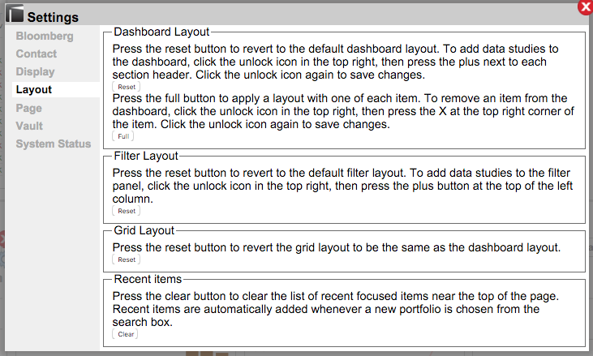

# Layout Defaults

## _How do I purge my changes to revert to the Lightkeeper default layout view?_

| |Click on the **Settings** icon on the upper right of the Lightkeeper screen and navigate to "Layout"  |
|:----|----|
|"Dashboard Layout"|(1) The first "Reset" button will remove all changes you've made to the layout of Statistics / Data Lenses, and revert to the Lightkeeper defaults for each section. (2) The "Full" button will add ALL Statistics / Data Lenses to your layout. (**CAUTION:** This may cause your browser to freeze or crash._|
|"Filter Layout"|Clicking "Reset" will remove all changes you've made to your Focus panel, and revert to the default list of filters.|
|"Grid Layout" |Clicking on the "Reset" button will change the grid layout to reflect the Dashboard layout; the order of the columns will be the same as the sequence you've set up for the Dashboard Statistics / Data Lenses.|
|"Recent Items" |Clicking "Clear" will remove the list of rollup / focus items in the dropdown on the top-center of the page view.  |

