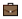
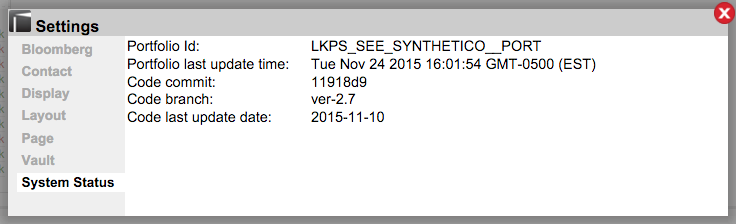

# System Status: Settings

## _How can I view Lightkeeper's system status?_

| |Click on the **Settings** icon on the upper right of the Lightkeeper screen and navigate to "System Status"  |
|:----|----|
|"Initialization"|Enter the name of the default portfolio to be shown upon opening or restarting Lightkeeper. _**NOTE:** You can choose your portfolio on-the-fly in the pull-down on the upper left of the page._ |
|"Time"|1) Select the default **Time Range** to be used whenever a different portfolio is selected. _**NOTE:** Time range can also be chosen on-the-fly in the "Show" area under the Lightkeeper logo toward the top left of the page._ 2) Choose the **Compounding Interval** from the drop-down menu: Day, Month, Quarter, Year.  3) Clicking on the **Auto-zoom** checkbox will automatically set your chosen date range as your whole data view.  Leaving it unchecked allows you to select your date range manually.|
|"Comparison Defaults" |Enter the name of the index to be used for default comparisons; this is relevant to beta statistics such as Beta, Beta Return, and Alpha Return.  _**NOTE:** After clicking on the blue "OK" button/bar, refresh your page view to see the changes selected._|

_Click the blue "OK" button/bar at the bottom of the screen to save your changes._

