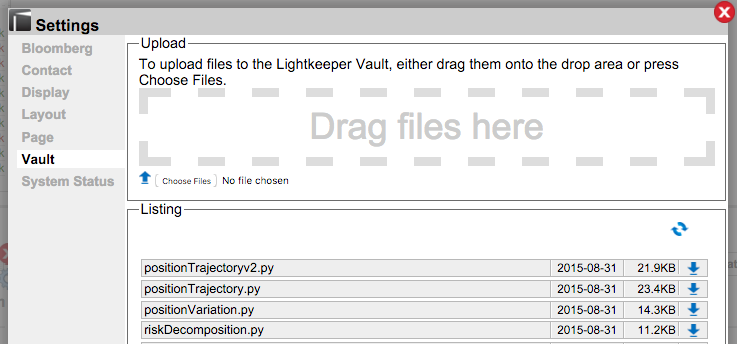

# Vault: Settings

## _How can I deliver files and patches to Lightkeeper for processing?_

 Click on the **Settings** icon on the upper right of the Lightkeeper screen and navigate to "Page"

##### To **upload** files:
+ drag and drop into the "Drag files here" area
+ or click on the "Choose Files" button and navigate to the file to upload.

##### To **download** files:
+ Locate the file you want and click the "download" button at the end of the appropriate row 
+ Refresh the view by clicking on the "refresh" icon 

